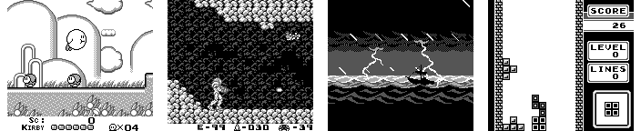

# BadDMG

A GameBoy (DMG) emulator with cycle-accurate CPU emulation and SDL3 frontend.



## Features

- Mostly cycle-accurate CPU emulation
- Good-enough PPU emulation
- MBC1 cartridge support
- Optional boot ROM support
- SDL3 based UI

## Project Structure and Architecture

The project is organized into several directories and modules:

- **src/**: Main source code for the emulator.
  - **app.cc / app.hh**: Implements the `Application` class, which sets up the emulator, SDL window, renderer, and manages the main emulation loop and user input. It wires together all core components.
  - **bdmg/**: Core emulator logic, including:
    - **bus.hh / bus.cc**: Defines the `Bus` class, which manages the memory map and device registration. All memory accesses from the CPU and other devices are routed through the Bus. Devices are registered to address ranges, and the Bus supports both regular and ticking devices (devices that need to be advanced every emulation step).
    - **cpu.hh / cpu.cc**: Defines the `Cpu` class, which emulates the GameBoy CPU, including instruction execution, register management, and interrupt handling. The CPU interacts with the Bus for all memory and device access. The CPU uses a `RegisterFile` union for register state and supports a large set of instruction templates for flexible opcode decoding.
    - **pixel-processor.hh / pixel-processor.cc**: Defines the `PixelProcessor` class (PPU), which handles graphics rendering, video RAM, OAM (sprite memory), LCD control, and scanline/frame timing. It implements a callback to notify the frontend when a frame is ready. The PPU is a ticking device and is advanced by the Bus.
    - **cartridge.hh / cartridge.cc**: Implements the `Cartridge` class, which loads and manages ROM and RAM data, supports MBC1, and exposes the cartridge as a device on the Bus.
    - **boot-rom.hh / boot-rom.cc**: Implements the `BootRom` class, which loads the GameBoy (optional) boot ROM and exposes it as a device.
    - **joypad.hh / joypad.cc**: Implements the `Joypad` class, which handles user input and exposes the joypad state as a device on the Bus.
    - **timer.hh / timer.cc**: Implements the `Timer` class, which emulates the GameBoy's timer hardware and is a ticking device.
    - **serial.hh / serial.cc**: Implements the `Serial` class, which emulates the serial port and is a ticking device (dummy for now).
    - **work-ram.hh / high-ram.hh**: Implements RAM devices for the GameBoy's memory map.
    - **device.hh**: Defines the `IDevice` and `ITickingDevice` interfaces, which all hardware components implement. Devices are registered with the Bus and can be advanced if they are ticking devices.
    - **common.hh**: Common types, utility functions, and constants (e.g., address ranges, vector types).

### Interconnections

**Device Registration and Memory Map:**
- Devices are registered to the Bus at specific address ranges (e.g., ROM, RAM, VRAM, OAM, I/O, etc.).
- The Bus maintains a mapping from address to device, and all reads/writes are routed to the correct device.
- Ticking devices (PPU, Timer, Serial) are advanced by the Bus each emulation step.

**Emulation Loop and Data Flow:**
- The Application runs the main loop, polling SDL events and updating the window.
- For each frame, the CPU is stepped until the PPU signals a frame is ready.
- The PPU (PixelProcessor) notifies the Application via a callback when a frame is ready, and the framebuffer is updated.
- Input events are processed by the Application and passed to the Joypad device.
- The Bus coordinates all device interactions and advances ticking devices.

## Building

Required dependencies:
- CMake 3.22+
- C++20 compiler
- Git (for dependencies)
- SDL3 (auto-fetched)
- argparse (auto-fetched)

```bash
mkdir build && cd build
cmake ..
cmake --build .
```

### Tested Configurations

The emulator has been tested on the following configurations:
* Ubuntu 24.04
  * Clang 19.0
  * CMake 3.22
  * SDL3

## Usage

Run the emulator with:
```bash
./BadDMG -c <rom-file>
```

### Options
- `-b, --boot-rom`: Path to boot ROM (optional)
- `-c, --cartridge`: Path to game ROM (required)

### Controls
- D-pad: Arrow keys
- A: Z key
- B: X key
- Start: Return key
- Select: Right Shift
- Screenshot: F12

Screenshots are saved as PGM files with timestamp in the current directory.

## Additional Resources

- [Building a GameBoy Emulator: BadDMG Project Overview](https://habr.com/ru/articles/908752/) - Detailed article about the project's implementation (in Russian)

## License

MIT License - see [LICENSE](LICENSE) file for details.

## Contributing

Contributions are welcome! Please feel free to submit a Pull Request.

## Roadmap

 - [ ] Implement sound emulation
 - [ ] Add SRAM saving option
 - [ ] Add support for more common MBC types (MBC3, MBC5, etc...)
